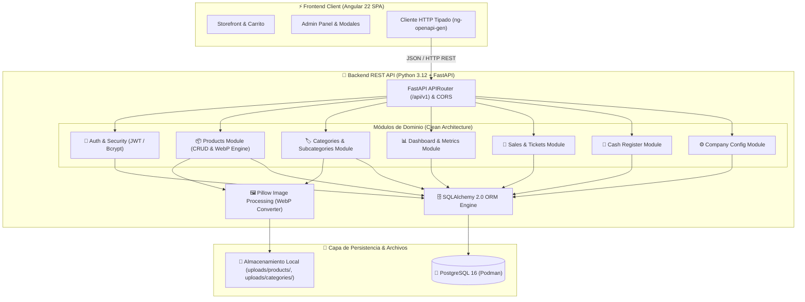

# 🤖 PauloBot Store — Backend REST API (Python & FastAPI)

[](https://www.python.org/)
[](https://fastapi.tiangolo.com/)
[](https://www.postgresql.org/)
[](https://podman.io/)
[](https://swagger.io/)
[](https://python-pillow.org/)

---

## 📌 Visión General de la Arquitectura

**PauloBot Store Backend** es un servicio API REST de alto rendimiento construido con **Python 3.12**, **FastAPI** y **PostgreSQL 16**. Proporciona la capa lógica de negocio, persistencia relacional, procesamiento de imágenes en formato WebP y contratos de datos tipados mediante esquemas Pydantic y OpenAPI 3.0 para la SPA Frontend (Angular 22).



---

## 🚀 Módulos del Sistema

### 📦 1. Módulo de Productos (`app/modules/products/`)
- **Catálogo & Destacados:** `GET /api/v1/products`, `GET /api/v1/products/featured`.
- **CRUD Administrativo:** Creación (`POST`), actualización (`PUT`) y eliminación (`DELETE`).
- **Gestión de Imágenes:** Conversión automática a formato `.webp` con compresión optimizada, guardado local en `uploads/products/` y entrega HTTP de alto rendimiento con cabeceras `Cache-Control: public, max-age=604800, immutable`.

### 🏷️ 2. Módulo de Categorías y Subcategorías (`app/modules/categories/`)
- **Jerarquía Comercial:** CRUD completo de Categorías (`/api/v1/categories`) y Subcategorías vinculadas (`/api/v1/subcategories`).
- **Soporte Multimedia:** Procesamiento de imágenes representativas para el carrusel infinito del storefront.

### 📊 3. Módulo de Dashboard & Analítica (`app/modules/dashboard/`)
- **KPIs en Tiempo Real:** Ventas totales, tickets emitidos, conteo de productos activos y stock bajo.
- **Gráfica de Ventas (7 Días):** Agrupación temporal de ingresos diarios para visualización analítica.

### 💸 4. Módulo de Ventas & Movimientos (`app/modules/sales/`)
- **Transacciones de Vending/POS:** Registro de comandas (`VentaComanda`) y partidas detalladas (`VentaDetalle`).
- **Historial & Auditoría:** Consulta y trazabilidad de movimientos de inventario y caja.

### 🔐 5. Autenticación & Usuarios (`app/modules/auth/`, `app/modules/users/`)
- **Seguridad:** Hashing seguro de contraseñas con `bcrypt` y generación de tokens `JWT (JSON Web Tokens)`.
- **Gestión de Usuarios:** Roles de sistema, permisos y auditoría de accesos.

### 🏧 6. Control de Caja y Configuración (`app/modules/cash_register/`, `app/modules/config/`)
- **Cortes de Caja:** Aperturas, retiros parciales y cierres de turno.
- **Configuración Empresarial:** Datos fiscales, logo, ticket info y preferencias del sistema.

---

## ⚙️ Cómo Ejecutar el Backend

### Opción A: Contenedores con Podman / Docker (Recomendado)

Inicia la base de datos PostgreSQL 16 y la API de FastAPI en contenedores aislados:

```bash
# Iniciar servicios en segundo plano
podman compose up -d

# Ver logs de la API
podman compose logs -f api
```

### Opción B: Entorno Virtual Python Local

1. **Crear y activar entorno virtual:**
```bash
python3 -m venv .venv
source .venv/bin/activate
```

2. **Instalar dependencias:**
```bash
pip install -r requirements.txt
```

3. **Configurar variables de entorno (`.env`):**
```env
HOST=0.0.0.0
PORT=8000
DEBUG=True

DB_TYPE=pgsql
DB_HOST=localhost
DB_PORT=5432
DB_NAME=paulobot_store
DB_USER=paulobot
DB_PASS=paulobot_password
```

4. **Sembrar base de datos inicial (Seed Data & Sequences):**
```bash
python app/seed_data.py
```

5. **Iniciar el servidor FastAPI:**
```bash
python run.py
# o directamente con uvicorn:
uvicorn app.main:app --host 0.0.0.0 --port 8000 --reload
```

---

## 📖 Documentación de la API

FastAPI genera automáticamente la documentación interactiva y el esquema estandarizado:

- 📑 **Swagger UI:** [`http://localhost:8000/api/docs`](http://localhost:8000/api/docs)
- 📚 **ReDoc:** [`http://localhost:8000/api/redoc`](http://localhost:8000/api/redoc)
- 📄 **OpenAPI Specification (JSON):** [`http://localhost:8000/api/v1/openapi.json`](http://localhost:8000/api/v1/openapi.json)

---

## 🛠️ Tech Stack del Backend

| Componente | Tecnología |
| :--- | :--- |
| **Lenguaje** | Python 3.12+ |
| **Framework Web** | FastAPI 0.115+ (ASGI Server: Uvicorn) |
| **Base de Datos** | PostgreSQL 16 (Alpine) |
| **ORM & Migraciones** | SQLAlchemy 2.0 & Psycopg2 |
| **Validación & DTOs** | Pydantic v2 & Pydantic Settings |
| **Procesamiento de Imágenes** | Pillow (Conversión a WebP optimizado) |
| **Seguridad & Auth** | PyJWT & Passlib / Bcrypt |
| **Contenedores** | Podman / Podman Compose |

---

<div align="center">
  <sub>Desarrollado con ❤️ y Clean Architecture por <a href="https://github.com/Paulob0t"><strong>Paulo Essau (Paulob0t)</strong></a></sub>
</div>
